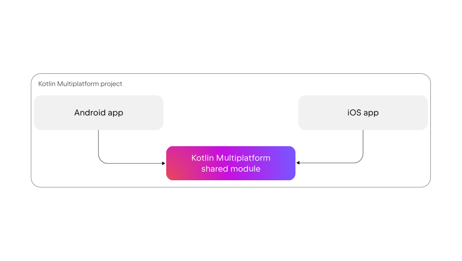

# Serach images Application (Kotlin Multiplatform Version)

  
  

   

 
   공통 모듈 : Ktor(네트워크), SQL Delight(내부 저장소), Kotlin Coroutine, Flow  
   안드로이드 모듈 : Jetpack Compose, ViewModel, Kotlin Coroutine, Flow, Coil  
   Koin(DI 라이브러리) 미적용 -> Container로 직접 DI를 구현하여 공부중
 

[라이브러리 목록] 
1. Jetpack Compose : UI 
   - Compose는 안드로이드에서 UI를 그리는 새로운 방법입니다. XML로 그리던 방식과 다르게 Kotlin으로 UI를 그릴 수 있습니다. 
   - Kotlin으로 UI를 그릴 수 있기 때문에 언어적 특성을 활용할 수 있다는 장점이 있습니다. 
   - 라이프 사이클이 View보다 간단합니다. 
   - 상태를 정의하는 방식인 MVI를 사용하기 용이합니다. 
2. Kotlin Coroutine : 비동기 
   - Coroutine은 비동기 작업 코드를 동기식으로 작성할 수 있도록 한다는 특징이 있습니다. 
   - 일반적으로 비동기 코드 작성은 어려울 수 있지만, Structured concurrency라는 특징으로 범위 내에 잘 작성한다면 메모리 누수 걱정이 줄어듭니다. 
3. Kotlin Flow : Reactive Stream
   - Flow는 Kotlin 언어 차원에서 지원하는 Reactive Stream 라이브러리 입니다. 
   - 클린 아키텍처를 사용할 때, 별도의 Reactive 관련 의존성을 추가하지 않아도 됩니다. 
   - 단순히 Cold Flow를 사용할 경우 누수가 발생할 수 있기 때문에 안드로이드에 맞춰 작성된 collectAsStateWithLifecycle()을 사용하는 것이 중요합니다. 
4. Ktor : 네트워크
5. Coil : 이미지 라이브러리
6. SQLDelight : 로컬 데이터베이스

